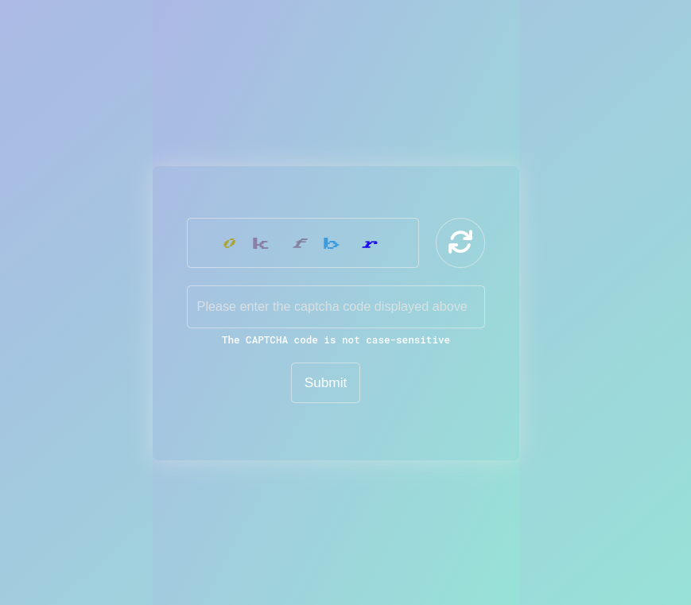

Check out my JavaScript-based Captcha Generator!

It creates unique, randomized CAPTCHA codes for
improved web form security, helping to differentiate
human users from bots. Includes features for CAPTCHA
validation and refresh.

Here's a screenshot:

