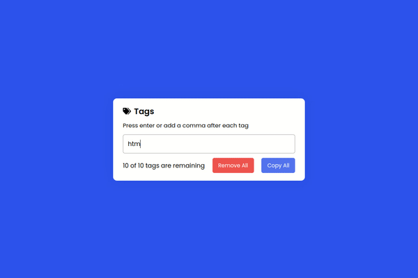
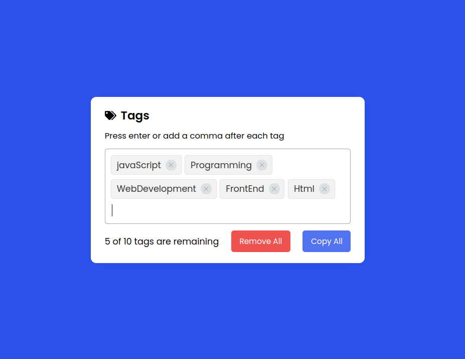

# Tag Generator

A simple JavaScript-based tag generator app that allows you to create and manage tags.

## Features

- Add tags by pressing Enter or using commas.
- Remove individual tags by clicking the "X" icon.
- Remove all tags with the "Remove All" button.
- Limited to a maximum of 10 unique tags.
- Error messages for invalid inputs and tag limit exceeded.
- Copy all tags to the clipboard with the "Copy All" button.
- When pasting, each tag name is prefixed with a "#" character.
- Spaces in tag names are replaced with underscores for consistency.

## Built With

- HTML
- CSS
- JavaScript

## Demo

